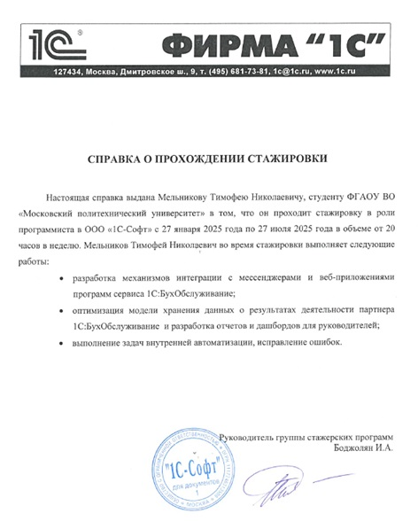

# Отчёт о стажировке в 1С-СОФТ

## О компании 1С
**1С** — ведущий российский разработчик программных решений для бизнеса. Платформа **1С:Предприятие** позволяет создавать системы:
- Автоматизации учёта
- Управления бизнес-процессами 
- CRM и ERP-решений
- Интеграции с внешними сервисами

## Моя стажировка
**Должность:** Стажёр-разработчик 1С  
**Сроки:** 27.01.2025 - 27.07.2025

**Основные задачи:**
- Разработка модулей обработки голосовых сообщений на 1С:Предприятие 8
- Интеграция мессенджеров (VK, Telegram, WhatsApp) через API
- Разработка механизма на 1С:Элемент для хранения и обработки аудиофайлов
- Создание механизма распознавания речи и отображения результатов
- Взаимодействие с фронтенд-разработчиком по API

## Приобретённый опыт и ключевые выводы

### Технические навыки:
✔ Углублённое освоение платформы 1С:Предприятие 8  
✔ Практический опыт работы с:
   - Механизмами технологической платформы 1С:Предприятие 8.3
   - 1С:Элемент для построения собственного HTTP-сервиса
   - Технологией распознавания речи
   - Внешними API и интеграциями
✔ Понимание полного цикла разработки - от ТЗ до релиза

### Профессиональные выводы:
1. **Важность архитектурных решений**  
   Осознал, как правильное проектирование системы с самого начала экономит время на последующих этапах

2. **Командная разработка**  
   Получил бесценный опыт взаимодействия в команде:
   - Согласование API с фронтенд-разработчиком
   - Совместная отладка интеграций
   - Участие в тестировании решения перед релизом

3. **Профессиональный рост**  
   Стажировка помогла:
   - Систематизировать знания 1С
   - Понять промышленные стандарты разработки
   - Научиться работать одновременно со многими технологиями

### Как это поможет в будущем:
- Полученные навыки позволяют претендовать на позицию штатного разработчика 1С
- Опыт интеграций полезен для работы с комплексными системами
- Понимание процессов разработки ускорит адаптацию в новых проектах

### Документ о прохождении стажировки

